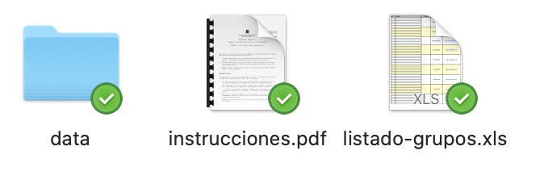
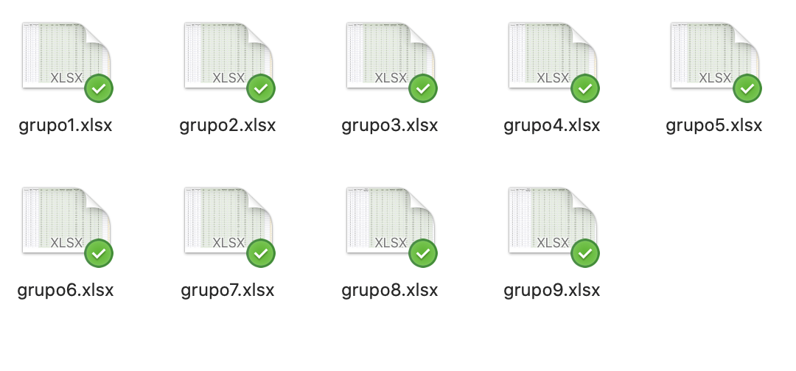

class: middle

# Unidad 3: Simulando un programa de prevención y promoción en salud.

Este seminario corresponde a la segunda unidad de la asignatura, y su evaluación equivale al 31.5% de la nota final.

---
class: middle

# Instrucciones 

Se formarán grupos de 6 estudiantes, en forma aleatoria. A cada grupo le tocará intervenir a una población predefinida, de forma simulada y guiada por un docente de la asignatura.

---
# Instrucciones

1. Debe buscar qué grupo y qué docente le corresponde. La distribución de los integrantes y sus docentes están inscritos en la planilla `'listado-grupos.xls'`, y además están organizados en Siveduc.

2. Una vez identificado su grupo, debe buscar en la carpeta `'data'` el archivo correspondiente a su grupo. Ahí encontrará los datos asignados para trabajar durante el desarrollo del seminario.

.center[]

---
# Instrucciones

Los datos varían aleatoriamente cada vez aue se abre el archivo.

---

# Instrucciones

3. Con estos datos, deberá realizar un diagnóstico de salud de su población, integrando los conceptos aprendidos principalmente en esta asignatura, y secundariamente en las asignaturas que ya ha aprobado.

4. Luego, tendrá que diseñar un programa de promoción para intervenir a esa población, **de acuerdo a su diagnóstico**. Tenga presente que la elección de la metodología debe tener, además, un sustento en la evidencia científica y su criterio.

5. Finalmente, debe presentar el impacto que ha tenido su intervención. Para esto, también dispone de datos simulados.

---
# Evaluación

La evaluación constará de 3 etapas:

1. Se evaluará 1 avance en forma presencial, el día miércoles 06 de enero en horario de asignatura. En caso de paro, toma, movilizaciones, o cualquier evento en que voluntariamente decidan suspender esta actividad, se hará solo por correo electrónico (**30% de la nota de seminario**).
2. Cada grupo deberá presentar su trabajo finalizado el día 20 de enero, en horario de asignatura (**65% de la nota de seminario**).
3. Durante todo el proceso, se aplicará la pauta de evaluación actitudinal (**5% de la nota de seminario**).

El detalle de cómo se calcula la nota para el avance y el seminario final aparece detallado en los archivos `'script-avance.R'` y `'script-seminario.R'`, respectivamente, en la carpeta `'/evaluaciones'`.

---

# Consultas:

## Foro de Siveduc

Favorece la colaboración con sus compañeros/as.

## Mail

Dr Halabi: diego.halabi@uach.cl

Dr Muñoz: helmuth.munoz@uach.cl

Dr Vera: cristian.vera@uach.cl